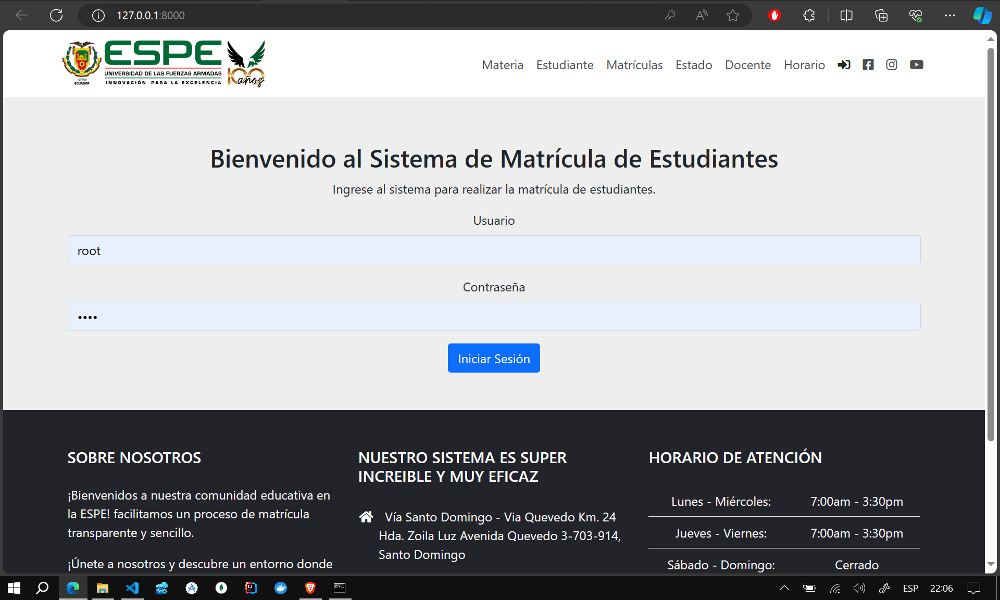
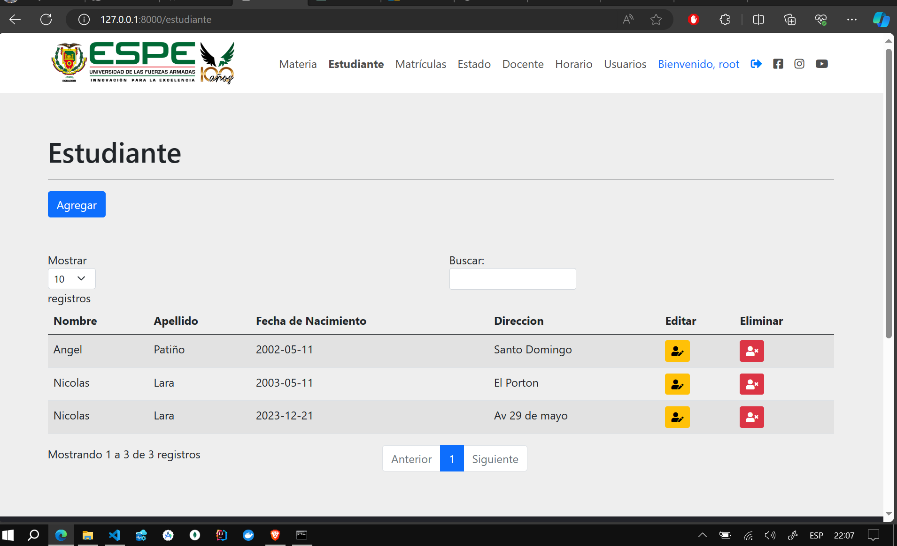
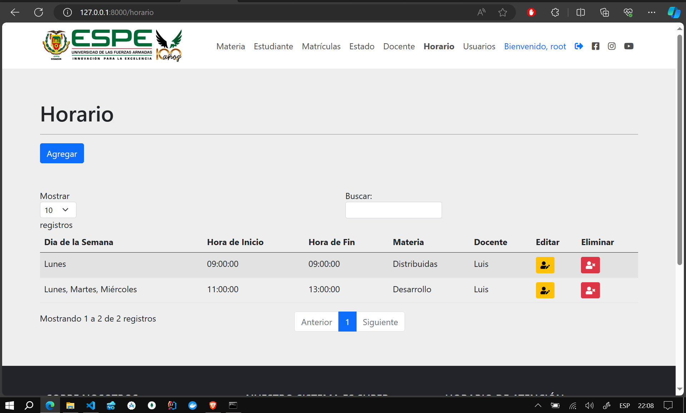
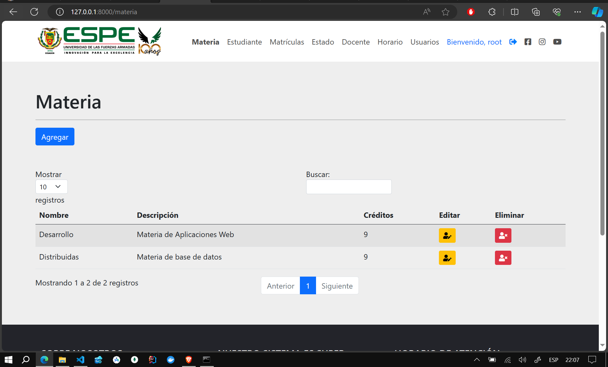
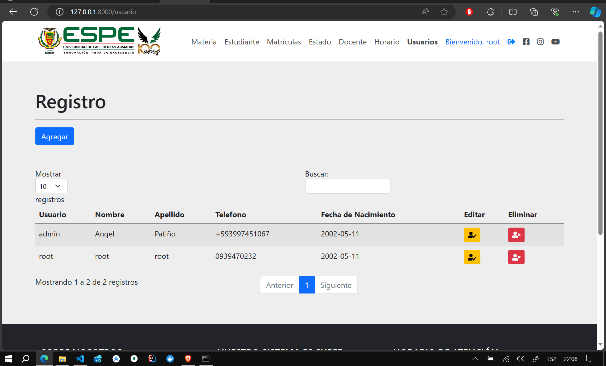
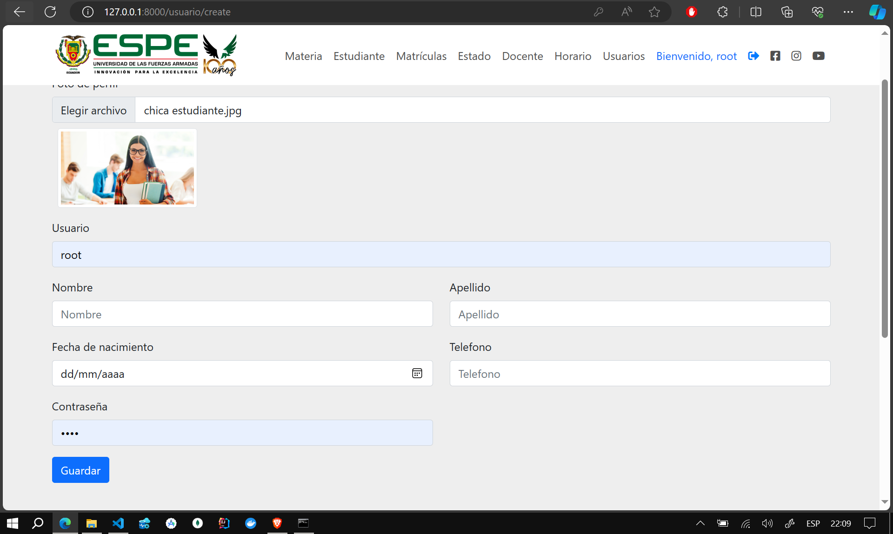
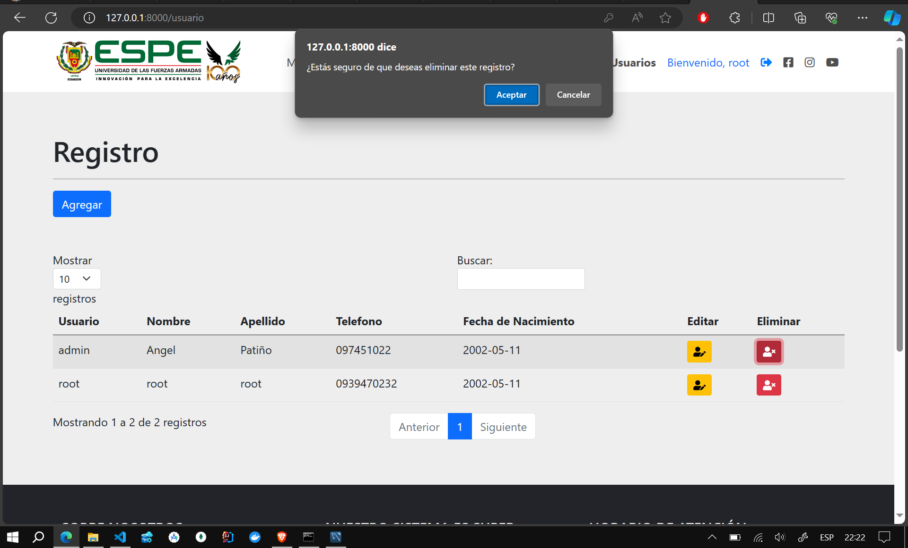

# Proyecto Laravel - Sistema de Matricula Académica

Este es un proyecto de Sistema de Gestión Académica desarrollado con Laravel, un framework de PHP. El sistema sigue el patrón de diseño Modelo-Vista-Controlador (MVC) y utiliza migraciones, modelos y controladores para organizar y gestionar los datos.

**Select Language:**
- [Español (Spanish)](README-es.md)
- [English](README.md)

## Results
### Base de Datos 
 
### Login 
 
### Docente 
 
### Estudiante 
 
### Horario 
 
### Materia 
 
### Matricula 
 
### Usuario 
 
### Agregar Usuario 
 
### Actualizar Usuario 
 
### Eliminar Usuario 
 
### Cerrar sesion 
 

## Instalación

1. Clona el repositorio en tu máquina local:

   bash
   git clone https://github.com/Anyel-ec/Laravel-MySQL-Docker-CRUD-Student-Enrollment-System
   

2. Instala las dependencias del proyecto:

   bash
   composer install
   

3. Copia el archivo de configuración .env:

   bash
   cp .env.example .env
   

4. Genera la clave de la aplicación:

   bash
   php artisan key:generate
   

5. Configura la base de datos en el archivo .env con tus credenciales.

6. Ejecuta las migraciones para crear las tablas de la base de datos:

   bash
   php artisan migrate
   

7. Inicia el servidor de desarrollo:

   bash
   php artisan serve
   

   El proyecto estará disponible en [http://localhost:8000](http://localhost:8000).

## Rutas y Controladores

### Materias

- Listar todas las materias:

  php
  Route::get('/materia', [MateriaController::class, 'index'])->name('materia.index');
  

- Crear una nueva materia:

  php
  Route::get('/materia/create', [MateriaController::class, 'create'])->name('materia.create');
  

- Almacenar una nueva materia en la base de datos:

  php
  Route::post('/materia/store', [MateriaController::class, 'store'])->name('materia.store');
  

- Editar una materia existente:

  php
  Route::post('/materia/edit/{id}', [MateriaController::class, 'edit'])->name('materia.edit');
  

- Actualizar una materia en la base de datos:

  php
  Route::post('/materia/update/{id}', [MateriaController::class, 'update'])->name('materia.update');
  

- Eliminar una materia:

  php
  Route::delete('/materia/destroy/{id}', [MateriaController::class, 'destroy'])->name('materia.destroy');
  

### Estudiantes, Matrículas, Docentes, Estados y Horarios

Se siguen patrones similares para las demás entidades del sistema, como estudiantes, matrículas, docentes, estados y horarios. Puedes explorar las rutas en el archivo web.php y los controladores respectivos para más detalles.

## Contribuciones

¡Siéntete libre de contribuir al proyecto! Abre un issue para discutir nuevas características o problemas, y realiza pull requests para proponer cambios.

## Licencia

Este proyecto está bajo la licencia [MIT](LICENSE).

¡Gracias por usar nuestro Sistema de Gestión Académica con Laravel!
