# Laravel Project - Academic Enrollment System

This is a Laravel-based Academic Management System, a PHP framework. The system follows the Model-View-Controller (MVC) design pattern and utilizes migrations, models, and controllers to organize and manage data.

**Select Language:**
- [Español (Spanish)](README-es.md)
- [English](README.md)

## Results
### Database 
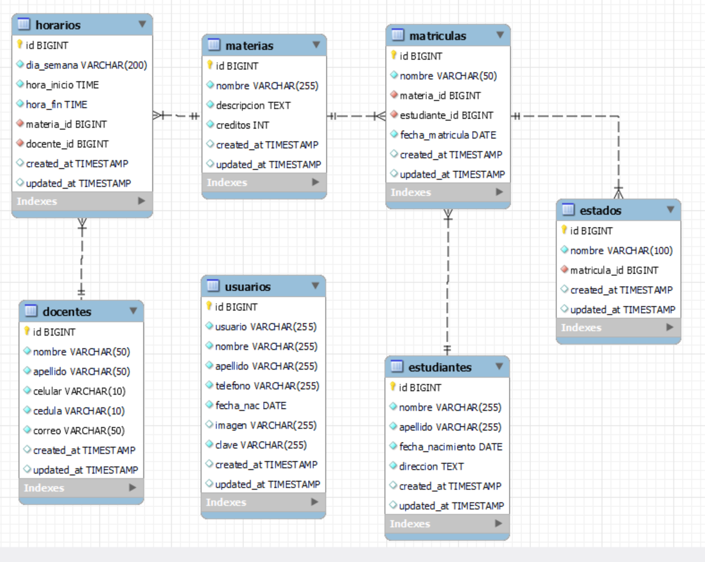 
### Login 
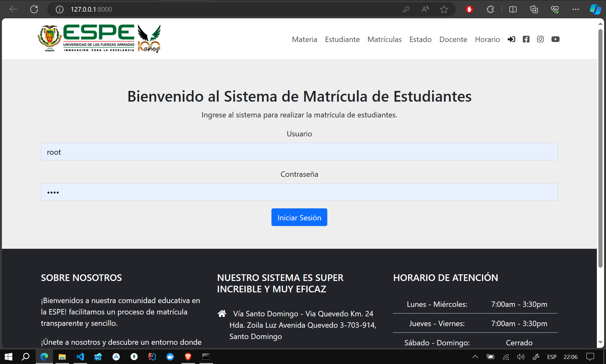 
### Teacher 
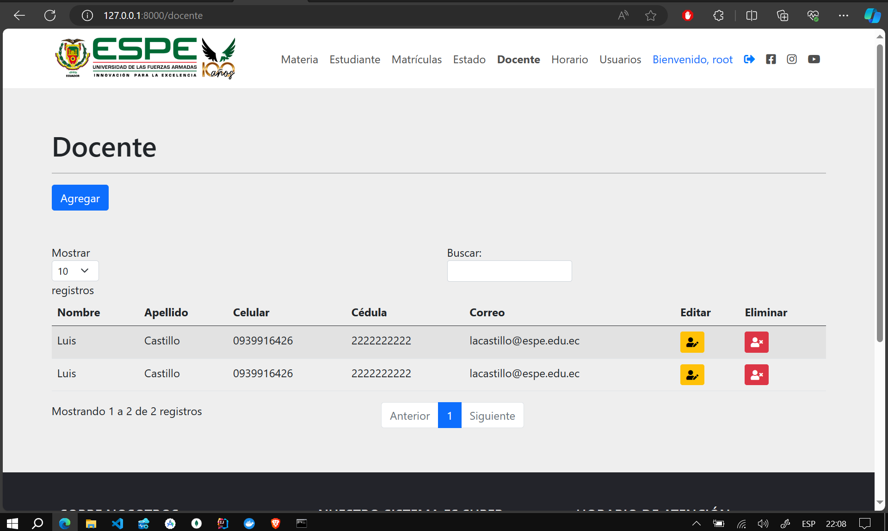 
### Student 
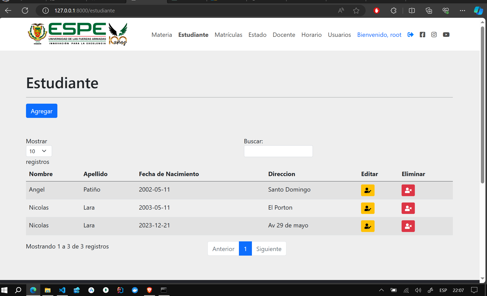 
### Schedule 
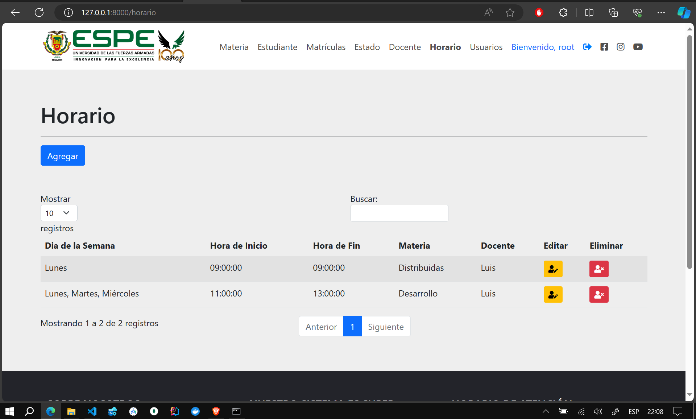 
### Subject 
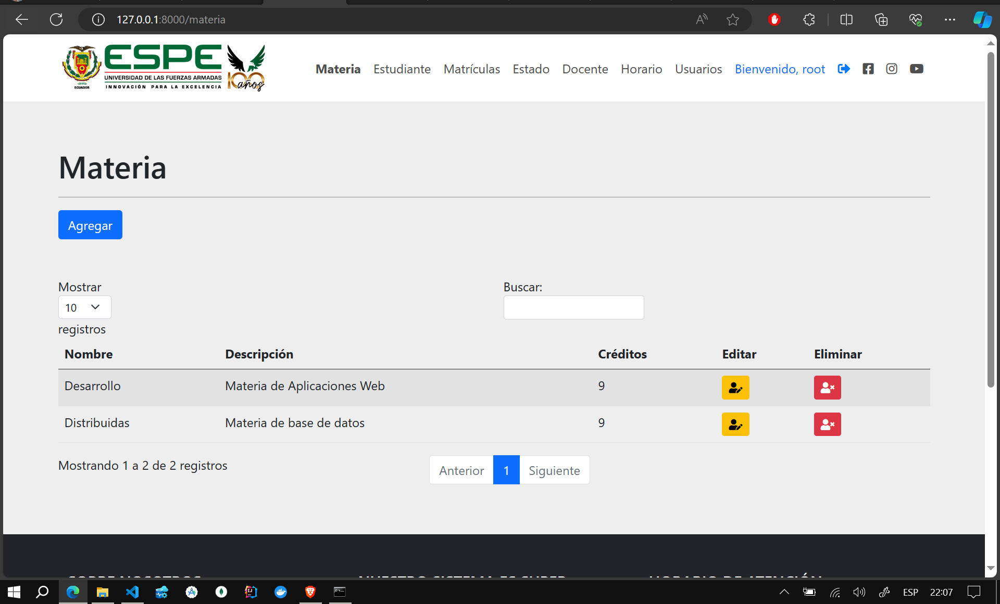 
### Enrollment 
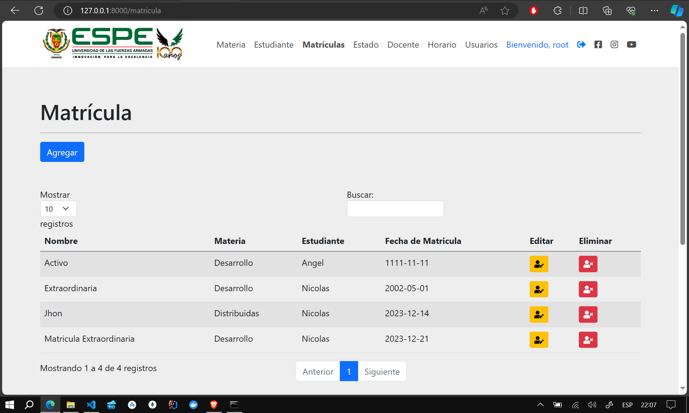 
### User 
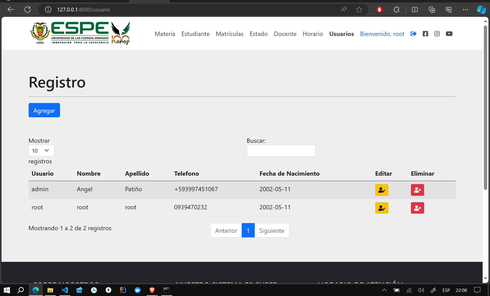 
### Add User 
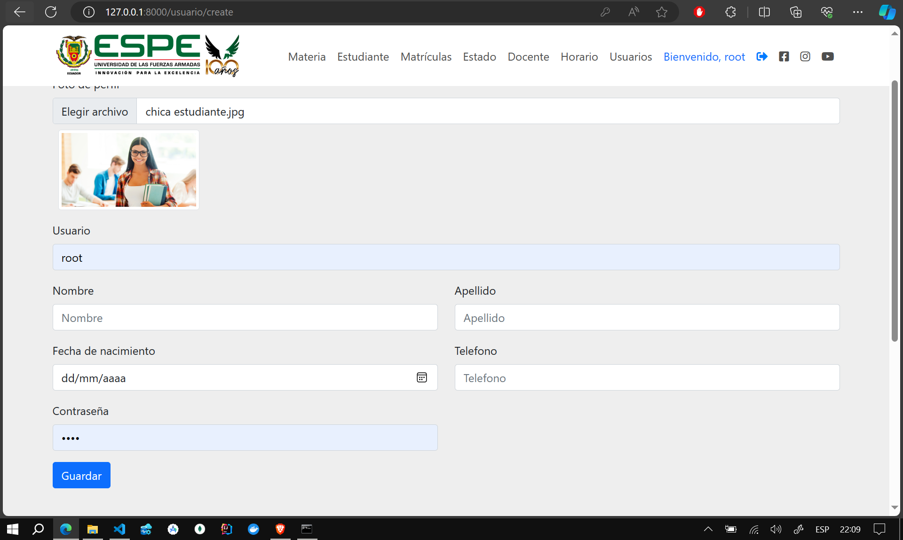 
### Update User 
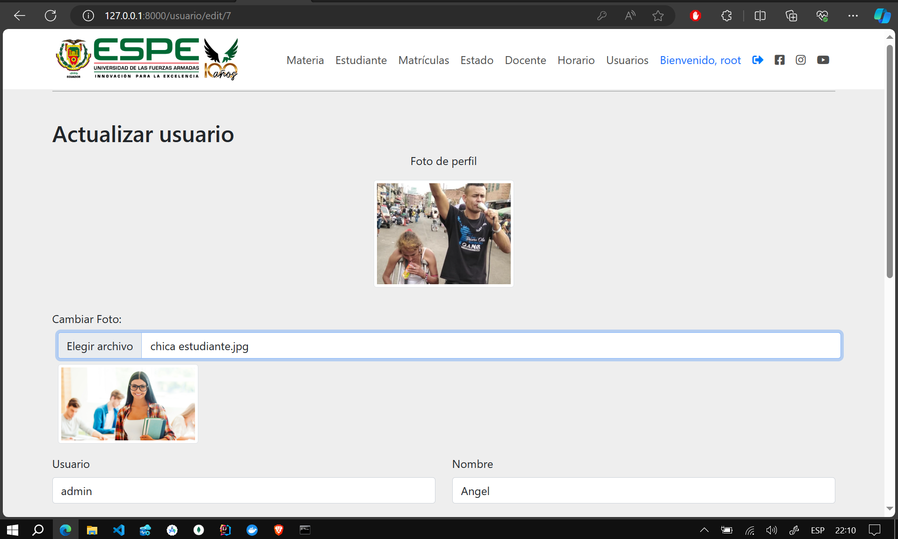 
### Delete User 
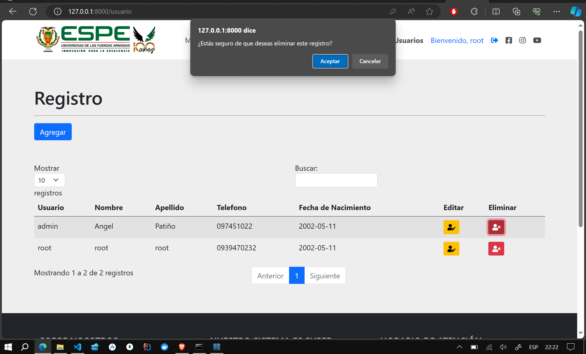 
### Logout 
 

## Installation

1. Clone the repository on your local machine:

   ```bash
   git clone https://github.com/Anyel-ec/Laravel-MySQL-Docker-CRUD-Student-Enrollment-System
   ```

2. Install project dependencies:

   ```bash
   composer install
   ```

3. Copy the configuration file .env:

   ```bash
   cp .env.example .env
   ```

4. Generate the application key:

   ```bash
   php artisan key:generate
   ```

5. Configure the database in the .env file with your credentials.

6. Run migrations to create database tables:

   ```bash
   php artisan migrate
   ```

7. Start the development server:

   ```bash
   php artisan serve
   ```

   The project will be available at [http://localhost:8000](http://localhost:8000).

## Routes and Controllers

### Subjects

- List all subjects:

  ```php
  Route::get('/subject', [SubjectController::class, 'index'])->name('subject.index');
  ```

- Create a new subject:

  ```php
  Route::get('/subject/create', [SubjectController::class, 'create'])->name('subject.create');
  ```

- Store a new subject in the database:

  ```php
  Route::post('/subject/store', [SubjectController::class, 'store'])->name('subject.store');
  ```

- Edit an existing subject:

  ```php
  Route::post('/subject/edit/{id}', [SubjectController::class, 'edit'])->name('subject.edit');
  ```

- Update a subject in the database:

  ```php
  Route::post('/subject/update/{id}', [SubjectController::class, 'update'])->name('subject.update');
  ```

- Delete a subject:

  ```php
  Route::delete('/subject/destroy/{id}', [SubjectController::class, 'destroy'])->name('subject.destroy');
  ```

### Students, Enrollments, Teachers, States, and Schedules

Similar patterns are followed for other entities in the system, such as students, enrollments, teachers, states, and schedules. You can explore the routes in the web.php file and the respective controllers for more details.

## Contributions

Feel free to contribute to the project! Open an issue to discuss new features or problems, and make pull requests to propose changes.

## License

This project is under the [MIT License](LICENSE).

Thank you for using our Academic Management System with Laravel!
